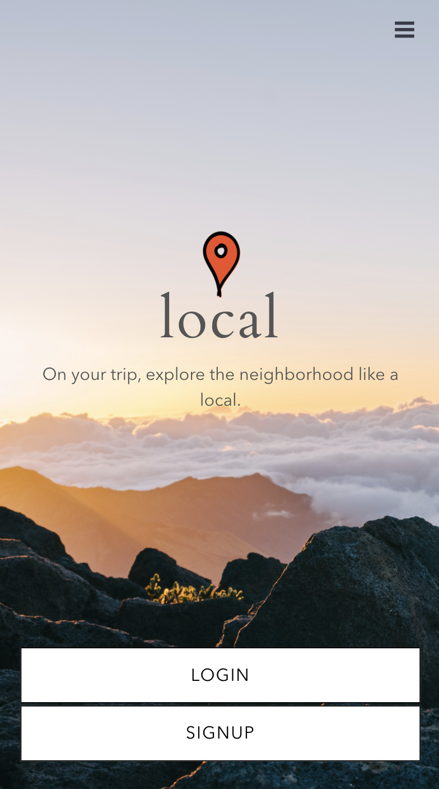
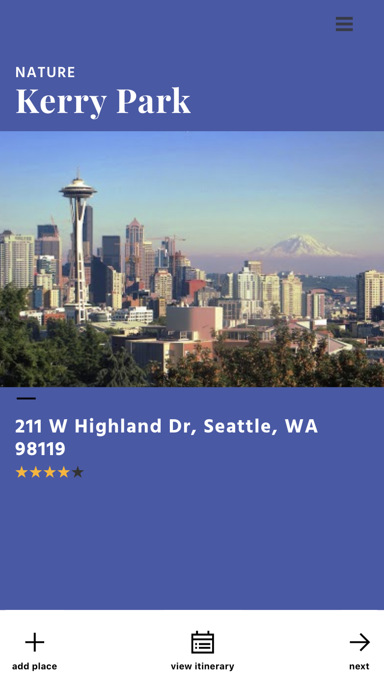
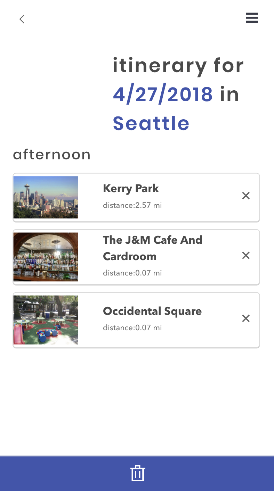

# [local](http://local-app.surge.sh/) 
Have you ever stressed out about trying to make the most of your traveling experience? The mobile-first web app [local](http://local-app.surge.sh/) completely eliminates the stress of planning. It allows users to create itineraries by adding activities rendered from a set of questions that the user answer.
Developed in two week.
## Built With 
* [ES6](http://es6-features.org/) - Javascript ES6 
* [React](https://reactjs.org/) - React 
* [React Router](https://github.com/ReactTraining/react-router) - React Router
* [Node.js](https://nodejs.org/en/) - Node 
* [Knex.js](http://knexjs.org/) - Knex 
* [PostgreSQL](https://www.postgresql.org/) - PostgreSQL 
* [Expressjs](https://expressjs.com/) - Express 

## Developers 
* **Joolee Chin** - [Joolee's GitHub](https://github.com/jooleechin) 

## Screenshots

## Splash Screen & Questions:
 

## Results & All Itinerary View:
 

## Itinerary & Click and Drag Demo:
 

## Links 
* [Front-end](https://github.com/jooleechin/local-frontend) 
* [Back-end](https://github.com/jooleechin/local-backend)
